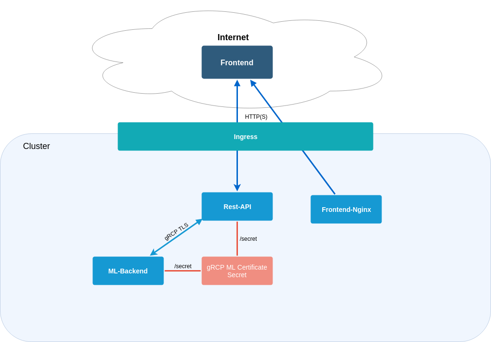

# workspace
A repo containig all repos and global-level issues
> Because this wont be up to date all the time run `git submodule update --recursive`

# How it works

The [ML-backend](https://github.com/fosefx-ml-ms/ML-backend) does the heavy lifting.
It's written in Python and utilizing the [Fast.ai library](https://docs.fast.ai).

Responsible for exposing the service to the web is [the rest-api service](https://github.com/fosefx-ml-ms/rest-api).
Unlike the ML service it's written in TypeScript (node.js) and dependent on expressjs.

They communicate using gRCP. The Protocol Buffer files are available [here](https://github.com/fosefx-ml-ms/protos/).

    

